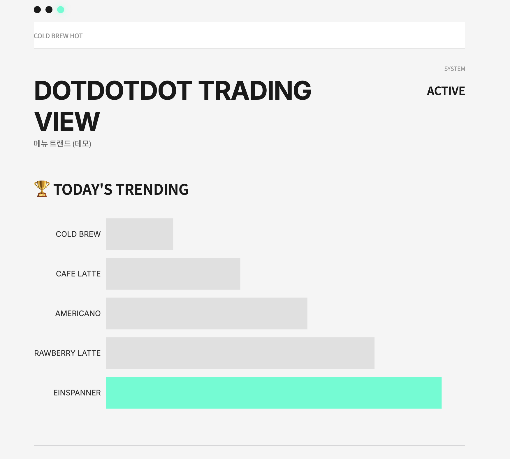
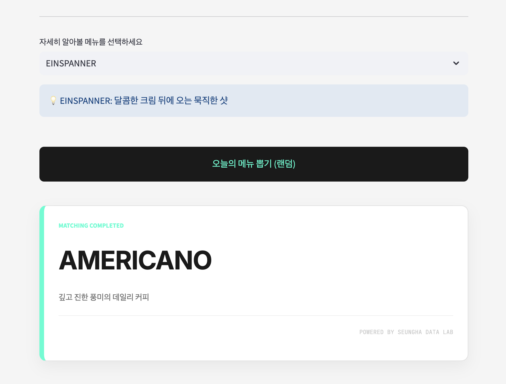
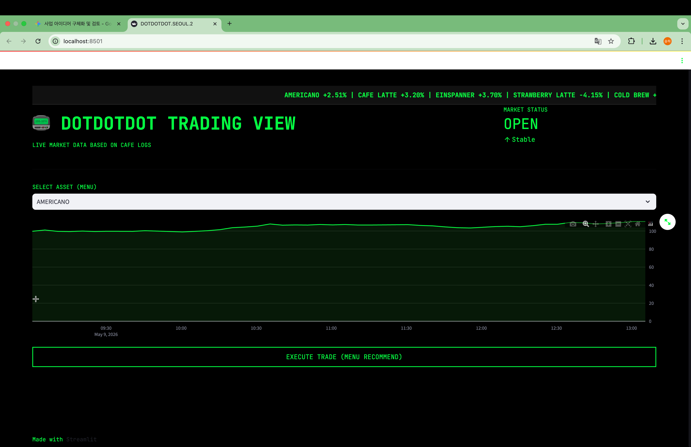

# dotdotdot

**단골 카페 사장님께 선물로 만든 메뉴 안내 웹.** 매장 모니터에 QR을 띄워, 손님이 자리에서 휴대폰으로 접속하는 형태로 운영했습니다.

> 2026년 5월 제작 · 매장에 실제로 적용했다가, 손님 이용이 저조해 며칠 뒤 내렸습니다.

🔗 **데모:** https://dotdotdot-menu.streamlit.app/
매장 운영은 종료되었고, 위 링크는 코드 동작 확인용으로 다시 올린 데모입니다.



---

## 문제 정의

자주 가던 카페 `dotdotdot.seoul.2`에는 손님이 메뉴를 고를 때 참고할 수 있는 게 카운터 위 메뉴판뿐이었습니다.

요청을 받은 게 아니라, **자리에 앉은 손님이 QR 한 번으로 메뉴를 훑고 고를 수 있으면 좋겠다**는 생각으로 직접 만들어 사장님께 보여드렸습니다.

---

## 결과

- Streamlit Cloud로 배포 → 매장 메뉴 모니터에 QR 표시
- 사장님 확인 후 실제 매장에 적용
- **손님들이 QR을 거의 찍지 않았고**, 이용이 저조해 며칠 뒤 내렸습니다
- 이후 추가 개발 없이 종료했습니다

기술적으로 막혀서 접은 게 아니라, **쓰이지 않아서 접었습니다.** 이 프로젝트에서 가장 크게 배운 부분입니다.

---

## 실행 방법

```bash
git clone https://github.com/sxnhxa/dotdotdot.git
cd dotdotdot

python -m venv .venv
source .venv/bin/activate      # Windows: .venv\Scripts\activate
pip install -r requirements.txt

streamlit run cafe.py
```

브라우저에서 `localhost:8501`이 열립니다.
`python cafe.py`로는 동작하지 않습니다 — Streamlit은 자체 서버가 스크립트를 대신 실행하는 구조이기 때문입니다.

---

## 구조

`cafe.py` 단일 스크립트(약 160줄)입니다. Streamlit은 위젯을 조작할 때마다 스크립트 전체를 처음부터 다시 실행하기 때문에, 별도의 진입점 함수 없이 위에서 아래로 흐릅니다.

```
페이지 설정
  ↓
CSS 주입 (매장 톤 · 모바일 대응 · 3점 로고)
  ↓
메뉴 데이터 정의 (menu_config)
  ↓
로고 / 티커 / 헤더 렌더
  ↓
순위 막대 차트 (수치 숨김)
  ↓
메뉴 선택 → 설명 표시
  ↓
버튼 클릭 → 랜덤 메뉴 카드 출력
```

```
dotdotdot/
├── .streamlit/config.toml   # 라이트 테마 고정
├── docs/                    # 스크린샷
├── cafe.py                  # 앱 전체
└── requirements.txt
```



**스택:** Streamlit · Plotly · pandas · numpy

---

## 주요 선택과 이유

### 1. Streamlit

화면이 한 페이지고, 혼자 이틀 안에 배포까지 끝내야 했습니다. 프론트엔드 프레임워크를 새로 익히는 비용에 비해 얻는 게 없다고 판단해, 파이썬만으로 UI와 배포가 모두 되는 Streamlit을 골랐습니다.

### 2. 매장 톤에 맞춘 CSS 전면 수정

처음 만든 버전은 검정 배경 + 형광 초록의 트레이딩 터미널 컨셉이었습니다. 제 취향에는 맞았지만 **매장 분위기(화이트 벽 · 민트 카운터 · 블랙 포인트)와 전혀 맞지 않았습니다.**



Streamlit 기본 테마로는 표현이 안 돼서 `st.markdown(unsafe_allow_html=True)`으로 CSS를 직접 주입했습니다.

| 매장 | 코드 |
|---|---|
| 밝은 벽면 | `#F5F5F5` (배경) |
| 민트 카운터 | `#00FFD1` (버튼 텍스트 · 1위 막대 · 카드 좌측 라인) |
| 블랙 카운터 | `#1A1A1A` |
| 3점 로고 | CSS `border-radius: 50%` 원 3개 (검정·검정·민트) |

### 3. 차트에서 수치를 전부 제거

초기 버전은 수치 축이 보이는 라인 차트였습니다. 사장님과 이야기하면서 **화면에 뜨는 숫자로 매출 규모가 유추될 수 있다**는 점을 알게 되어, 순위만 남기고 숫자를 전부 없앴습니다.

```python
xaxis=dict(showgrid=False, visible=False)   # X축(수치) 제거
hoverinfo='none'                            # 호버해도 숫자 노출 안 됨
```

**보여줄 수 있는 정보와 보여주면 안 되는 정보를 사용자와 이야기해서 나눈 첫 경험**이었습니다.

### 4. 모바일 우선

QR로 들어오는 손님은 100% 휴대폰입니다. `@media (max-width: 768px)` 분기로 여백·제목 크기·차트 높이를 따로 지정하고, 버튼은 `width: 100%`로 화면을 꽉 채웠습니다.

---

## 한계와 개선 계획

정확하게 남깁니다.

| 한계 | 설명 |
|---|---|
| **순위가 실제 데이터가 아님** | 막대 차트의 메뉴 순서는 판매 데이터가 아니라 제가 매장에서 관찰한 인상에 근거한 임의값입니다. |
| **추천이 추천이 아님** | 버튼은 `random.choice()` 룰렛입니다. 취향 입력도, 학습된 모델도 없습니다. |
| **다크 모드에서 화면이 깨졌음** | 배경색만 CSS로 덮어써서, 접속자가 다크 모드면 일부 제목과 라벨이 흰 글자로 남아 보이지 않았습니다. 운영 당시에는 이 사실을 몰랐고, 이후 `.streamlit/config.toml`로 테마를 고정해 해결했습니다. |
| **이용률을 측정할 수단이 없었음** | QR을 왜 안 찍는지 데이터가 없어 추측만 가능했습니다. |
| **단일 스크립트** | 함수·모듈 분리가 없어 화면이 늘어나면 관리가 어려운 구조입니다. |

**다시 만든다면** — 순위를 지어내는 대신 사장님이 직접 순위를 입력하는 간단한 관리 화면을 먼저 만들고, QR 접속 수를 세는 것부터 시작하겠습니다. 데이터가 없는 상태에서 "실시간"과 "추천"이라는 말을 화면에 쓴 것이 이 프로젝트의 가장 큰 실수였습니다.
